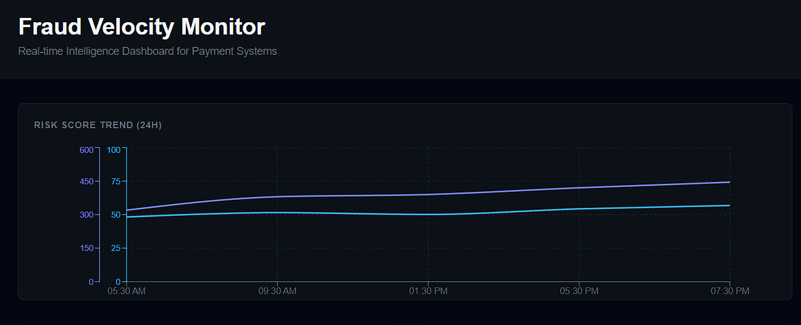
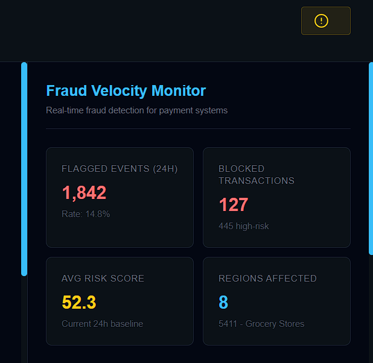
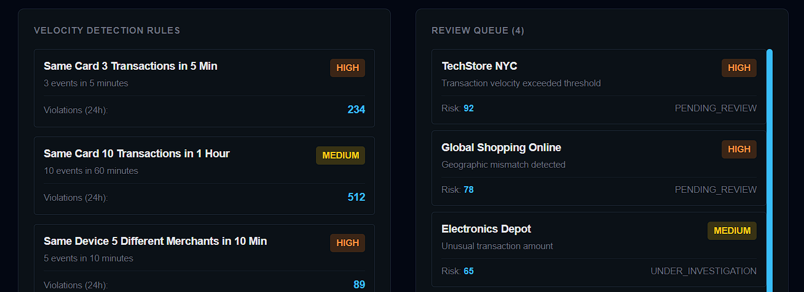
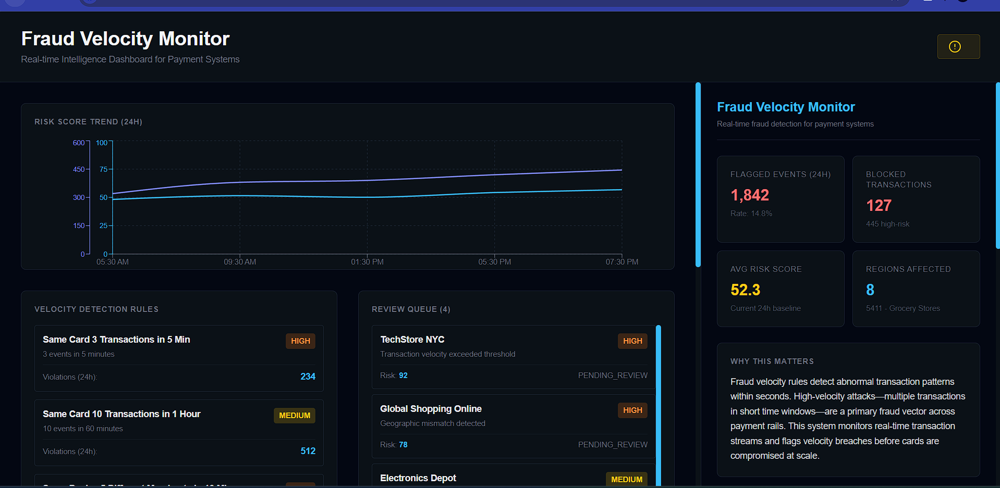
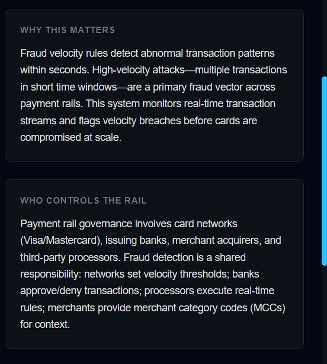
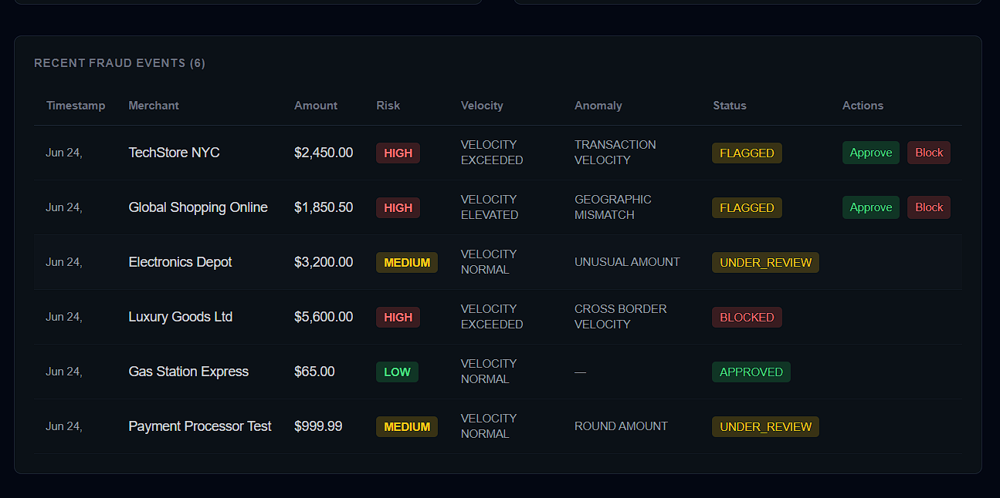
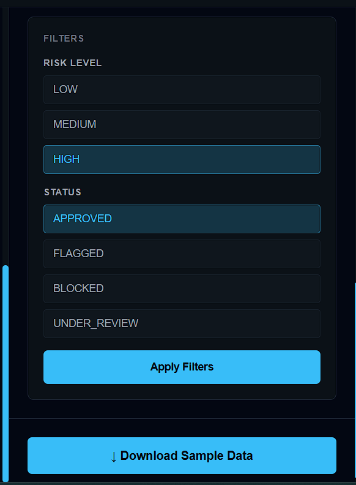

# Fraud Velocity Monitor — Real Rails Intelligence Library

Production-style demo application for fraud detection and velocity monitoring in payment systems. Fully containerized with Docker for zero-friction deployment.

## 📋 Project Overview

| Field | Value |
|-------|-------|
| **Project ID** | POC-7 |
| **Architect** | Livin Linson |
| **Batch** | Batch 5 Interns |
| **Rail Category** | Payments |
| **Data Sources** | CFPB, FRED (with synthetic mock data for event-level feeds) |
| **Purpose** | Real-time fraud detection, velocity rule monitoring, and anomaly alerting |
| **Status** | ✅ Production Ready |

---

## 🏗️ Architecture

### Backend (FastAPI)
- **Location:** `/backend`
- **Port:** `8000`
- **Container:** `rails_backend`
- **Key Endpoints:**
  - `GET /api/fraud-events` — Retrieve fraud transaction events
  - `GET /api/analytics` — High-level metrics dashboard
  - `GET /api/risk-score-trend` — Risk score time series
  - `GET /api/velocity-rules` — Active velocity detection rules
  - `GET /api/review-queue` — Items pending human review
  - `POST /api/fraud-events/{id}/approve` — Approve transaction
  - `POST /api/fraud-events/{id}/block` — Block transaction
  - `GET /api/sample-data` — Download mock dataset

### Frontend (Next.js 14+)
- **Location:** `/frontend`
- **Port:** `3000`
- **Container:** `rails_frontend`
- **Stack:** React, TypeScript, Tailwind CSS, Recharts
- **Design:** 2-Column Layout (70% Main Stage + 30% Intelligence Sidebar)

---

## 🎨 Visual Identity

**Color Palette (Real Rails DNA):**

| Token | Hex | Usage |
|-------|-----|-------|
| Background | `#030712` | Obsidian Black — page background |
| Surface/Cards | `#0B1117` | Deep Navy Grey — card backgrounds |
| Accent Primary | `#38BDF8` | Electric Cyan — interactive elements |
| Accent Secondary | `#818CF8` | Indigo — secondary highlights |
| Borders | `#1F2937` | Slate-800 — 1px borders |

**Style:** Subtle glassmorphism on cards; 0.5px cyan glow on active elements

---

## 🐳 Docker Deployment (Recommended)

The easiest way to run the full stack is with Docker Compose.

### Prerequisites
- [Docker Desktop](https://www.docker.com/products/docker-desktop/) installed and running

### 1. Configure Environment Variables

Copy the root-level `.env.example` to `.env` and fill in your values:

```bash
cp .env.example .env
```

```env
# Mapbox API Key for Geographic Visualizations (optional)
MAPBOX_API_KEY=your_mapbox_api_key_here

# Data API Key for backend external intelligence (optional)
DATA_API_KEY=your_data_api_key_here

# Backend API URL (frontend uses this to reach the API)
NEXT_PUBLIC_API_URL=http://localhost:8000
```

### 2. Build & Start All Services

```bash
docker compose up --build
```

| Service | URL |
|---------|-----|
| Frontend | http://localhost:3000 |
| Backend API | http://localhost:8000 |
| Swagger Docs | http://localhost:8000/docs |

### 3. Stop Services

```bash
docker compose down
```

### Docker Architecture

```
docker-compose.yml
├── rails_backend   (python:3.11-slim)
│   ├── FastAPI + Uvicorn
│   └── Port 8000
└── rails_frontend  (node:18-alpine, multi-stage build)
    ├── Stage 1: deps    — install npm dependencies
    ├── Stage 2: builder — build Next.js production bundle
    └── Stage 3: runner  — serve with non-root user
        └── Port 3000
```

Both containers share a custom bridge network (`rails_network`) and restart automatically unless stopped.

---

## 🚀 Local Development (Without Docker)

### Backend Setup

```bash
cd backend
python -m venv venv
# Windows:
venv\Scripts\activate
# macOS/Linux:
source venv/bin/activate

pip install -r requirements.txt
python app.py
```

Backend will run on `http://localhost:8000`

**API Docs:** http://localhost:8000/docs

### Frontend Setup

```bash
cd frontend
npm install
cp .env.example .env.local   # set NEXT_PUBLIC_API_URL=http://localhost:8000
npm run dev
```

Frontend will run on `http://localhost:3000`

---

## 📁 Project Structure

```
poc1/
├── .env.example              # Root env template (for Docker Compose)
├── .env                      # Your local secrets (git-ignored)
├── docker-compose.yml        # Unified service orchestration
├── README.md
├── DEVELOPMENT.md
├── PROJECT_STRUCTURE.md
├── DEPLOYMENT_SUMMARY.md
│
├── backend/
│   ├── Dockerfile            # python:3.11-slim — single stage
│   ├── app.py                # FastAPI server (10 endpoints)
│   ├── data_adapter.py       # CFPB/FRED data source adapter
│   ├── mock_data.json        # Pre-generated fraud dataset
│   └── requirements.txt
│
├── frontend/
│   ├── Dockerfile            # node:18-alpine — 3-stage multi-stage build
│   ├── .env.example          # Frontend env template
│   ├── app/
│   │   ├── layout.tsx
│   │   ├── page.tsx
│   │   └── globals.css
│   ├── components/
│   │   ├── AnalyticsHeader.tsx       # KPI metric cards
│   │   ├── CollapsibleSection.tsx    # Accordion wrapper for sidebar sections
│   │   ├── DashboardHeader.tsx       # Top navigation bar
│   │   ├── DeveloperSignature.tsx    # Author details modal
│   │   ├── FilterPanel.tsx           # Risk/status filter controls
│   │   ├── FraudEventsTable.tsx      # Transaction log with approve/block
│   │   ├── IntelligenceSidebar.tsx   # 30% sidebar container
│   │   ├── LoadingSpinner.tsx
│   │   ├── MainStage.tsx             # 70% main content area
│   │   ├── ReviewQueue.tsx
│   │   ├── RiskTrendChart.tsx        # Recharts dual-axis line chart
│   │   └── VelocityRulesList.tsx
│   ├── lib/
│   │   ├── api.ts            # Axios API client
│   │   └── utils.ts
│   └── types/
│       └── index.ts
│
└── screenshots/
    ├── 02-risk-trend-chart.png
    ├── 03-analytics-kpi-cards.png
    ├── 04-velocity-rules-review-queue.png
    ├── 05-fraud-events-table.png
    ├── 06-filters-panel.png
    ├── 07-educational-content.png
    └── 08-full-dashboard-layout.png
```

---

## 📊 Dashboard Sections

### Main Stage (70% Width)
1. **Risk Trend Chart** — Dual-axis line chart: avg risk score (cyan) & high-risk count (indigo) over 24h
2. **Velocity Rules** — Grid of active velocity detection rules with violation counts
3. **Review Queue** — Items flagged for manual review with priority levels
4. **Fraud Events Table** — Recent transactions with filtering, approve/block actions

### Intelligence Sidebar (30% Width)

Each section is wrapped in a collapsible accordion (`CollapsibleSection.tsx`):

| Section | Content |
|---------|---------|
| **A — Title & Metrics** | KPI cards: Flagged, Blocked, Avg Risk Score, Regions Affected |
| **B — Why This Matters** | Educational context on velocity-based fraud detection |
| **C — Who Controls the Rail** | Governance: card networks, banks, processors, merchants |
| **D — Functional Filters** | Risk Level + Status multi-select filters |
| **E — Download** | Export mock dataset as JSON |

---

## 📸 Screenshots

### 1. Risk Trend Chart (24-Hour View)

Dual-axis Recharts line chart:
- **Left Y-Axis (Cyan):** Average Risk Score (0–100%)
- **Right Y-Axis (Indigo):** High Risk Count (events)

### 2. Analytics KPI Cards

- 🚨 **Flagged Events (24H):** 1,842 (Rate: 14.8%)
- 🛑 **Blocked Transactions:** 127 (445 high-risk)
- 📊 **Avg Risk Score:** 52.3
- 🌍 **Regions Affected:** 8 countries

### 3. Velocity Rules & Review Queue


**Left Panel - Velocity Detection Rules:**
1. **Same Card 3 Transactions in 5 Min** - 234 violations (HIGH priority)
2. **Same Card 10 Transactions in 1 Hour** - 512 violations (MEDIUM priority)
3. **Same Device 5 Different Merchants in 10 Min** - 89 violations (HIGH priority)

**Right Panel - Review Queue (4 items):**
- **TechStore NYC** - Risk 92 (PENDING_REVIEW, HIGH priority)
- **Global Shopping Online** - Risk 78 (PENDING_REVIEW, HIGH priority)
- **Electronics Depot** - Risk 65 (UNDER_INVESTIGATION, MEDIUM priority)

### 4. Fraud Events Table


| Merchant | Amount | Risk | Velocity | Anomaly | Status |
|----------|--------|------|----------|---------|--------|
| TechStore NYC | $2,450.00 | HIGH | EXCEEDED | TRANSACTION_VELOCITY | FLAGGED |
| Global Shopping Online | $1,850.50 | HIGH | ELEVATED | GEOGRAPHIC_MISMATCH | FLAGGED |
| Electronics Depot | $3,200.00 | MEDIUM | NORMAL | UNUSUAL_AMOUNT | UNDER_REVIEW |
| Luxury Goods Ltd | $5,600.00 | HIGH | EXCEEDED | CROSS_BORDER_VELOCITY | BLOCKED |
| Gas Station Express | $65.00 | LOW | NORMAL | — | APPROVED |
| Payment Processor Test | $999.99 | MEDIUM | NORMAL | ROUND_AMOUNT | UNDER_REVIEW |

### 5. Filters & Controls Panel


**Risk Level Selector:**
- ☐ LOW (< 30 risk score)
- ☐ MEDIUM (30-60 risk score)
- ☑️ HIGH (> 60 risk score) — *Selected*

**Status Selector:**
- ☑️ APPROVED
- ☐ FLAGGED
- ☐ BLOCKED
- ☐ UNDER_REVIEW

**Buttons:**
- **Apply Filters** - Cyan button to refresh table with selected criteria
- **Download Sample Data** - Cyan button to export mock_data.json

### 6. Educational Content Sections


**Why This Matters:**
"Fraud velocity rules detect abnormal transaction patterns within seconds. High-velocity attacks—multiple transactions in short time windows—are a primary fraud vector across payment rails."

**Who Controls the Rail:**
"Payment rail governance involves card networks (Visa/Mastercard), issuing banks, merchant acquirers, and third-party processors."

### 7. Full Dashboard Layout (70/30 Split)

- **Left (70%):** Risk trend chart, velocity rules, review queue, fraud events table
- **Right (30%):** Intelligence sidebar with analytics cards, educational content, filters
- **Color Scheme:** Real Rails DNA (#030712 background, #38BDF8 cyan accents, #818CF8 indigo)

---

## 📡 Mock Data

All data is pre-generated in `/backend/mock_data.json`:
- 6 realistic fraud events with varying risk scores
- 4 velocity detection rules with violation counts
- 4 items in review queue with different priorities
- Risk score trend data for the past 24 hours
- High-level analytics metrics

> **Auto-Fallback:** If the backend API is unavailable, the frontend automatically falls back to mock data.

---

## 🔐 Security & Environment Variables

| Variable | Description | Required |
|----------|-------------|----------|
| `DATA_API_KEY` | Backend key for external intelligence data | Optional |
| `MAPBOX_API_KEY` | Mapbox key for geographic visualizations | Optional |
| `NEXT_PUBLIC_API_URL` | URL the frontend uses to reach the backend | Yes (defaults to `http://localhost:8000`) |

- ✅ All secrets managed via `.env` file (never committed)
- ✅ No hardcoded credentials in source code
- ✅ CORS enabled for frontend–backend communication
- ✅ API validation with Pydantic schemas
- ✅ Non-root users inside both Docker containers

---

## 📝 Features Implemented

### Fraud Detection
- [x] Real-time event ingestion
- [x] Risk scoring (0–100)
- [x] Velocity rule evaluation
- [x] Anomaly type classification
- [x] Geographic velocity checks

### Visualization
- [x] Risk trend chart (Recharts dual-axis)
- [x] Velocity rules list
- [x] Review queue prioritization
- [x] Fraud events table
- [x] Device fingerprint tracking
- [x] IP address logging

### User Interactions
- [x] Filter by risk level
- [x] Filter by transaction status
- [x] Approve / block transactions
- [x] Download sample data
- [x] Collapsible sidebar sections (`CollapsibleSection`)
- [x] Developer signature modal (`DeveloperSignature`)
- [x] Responsive layout

### Containerization
- [x] Backend Dockerfile (python:3.11-slim, non-root user)
- [x] Frontend Dockerfile (node:18-alpine, multi-stage build)
- [x] Docker Compose orchestration with bridge network
- [x] Environment variable injection via root `.env`

---

## 🧪 Testing the System

### Via Browser
1. `docker compose up --build` (or start services manually)
2. Visit `http://localhost:3000`
3. Use sidebar filters to explore risk levels
4. Review risk trend chart and queue
5. Approve or block transactions in the events table
6. Download sample data

### Via API (cURL)
```bash
# Get fraud events
curl http://localhost:8000/api/fraud-events

# Get analytics
curl http://localhost:8000/api/analytics

# Get risk trend
curl http://localhost:8000/api/risk-score-trend

# Get velocity rules
curl http://localhost:8000/api/velocity-rules

# Get review queue
curl http://localhost:8000/api/review-queue

# Approve a transaction
curl -X POST http://localhost:8000/api/fraud-events/EVT_001/approve

# Block a transaction
curl -X POST http://localhost:8000/api/fraud-events/EVT_001/block
```

---

## 🛠️ Troubleshooting

**Frontend can't connect to backend:**
- Ensure `NEXT_PUBLIC_API_URL` in `.env` points to the correct host
- In Docker: use `http://localhost:8000` from the host machine
- Restart containers: `docker compose down && docker compose up`

**Docker build fails:**
- Ensure Docker Desktop is running
- Try `docker compose build --no-cache` for a clean rebuild
- Verify `.env` exists at the project root

**Backend API returns 500:**
- Verify `mock_data.json` exists in the `backend/` folder
- Check all Pydantic models match the API response schema

**Ports already in use:**
- Backend: change the host port in `docker-compose.yml` (e.g., `"8001:8000"`)
- Frontend: change to `"3001:3000"` and update `NEXT_PUBLIC_API_URL`

---

## 📦 Dependencies

### Backend
| Package | Version |
|---------|---------|
| fastapi | 0.104.1 |
| uvicorn | 0.24.0 |
| pydantic | 2.5.0 |
| pandas | 2.1.3 |
| python-dateutil | 2.8.2 |
| python-multipart | 0.0.6 |

### Frontend
| Package | Version |
|---------|---------|
| next | 14.0.0 |
| react | 18.2.0 |
| tailwindcss | 3.3.0 |
| recharts | 2.10.0 |
| axios | 1.6.0 |

---

## 📖 API Documentation

| Interface | URL |
|-----------|-----|
| Swagger UI | http://localhost:8000/docs |
| ReDoc | http://localhost:8000/redoc |

---

## 📚 Real Rails Protocol Compliance

| Check | Status |
|-------|--------|
| Visual Identity — colors match DNA specs | ✅ |
| Layout — 2-column 70/30 split | ✅ |
| Backend First — FastAPI schema before frontend | ✅ |
| Intelligence Layer — every data point includes context | ✅ |
| Mock Fallback — continues with mock data if API down | ✅ |
| Terminology — "Rail," "velocity," "governance" consistent | ✅ |
| Guardrails — env vars, no hardcoded credentials | ✅ |
| Containerization — Docker + Compose for portability | ✅ |

---

## 🎯 Next Steps (Enhancement Ideas)

- [ ] Live Mapbox integration for geographic fraud visualization
- [ ] WebSocket support for real-time event streaming
- [ ] Database persistence (PostgreSQL)
- [ ] Authentication / authorization layer
- [ ] Advanced anomaly detection ML model
- [ ] Email / Slack alerting for high-priority cases
- [ ] Historical analytics and trends
- [ ] Merchant dispute workflow
- [ ] GitHub Actions CI/CD pipeline

---

**Built with Real Rails Protocol v1.0**  
Real-time Intelligence Library for Payment Infrastructure  
© 2026 Infocreon Internship — Architect: Livin Linson
